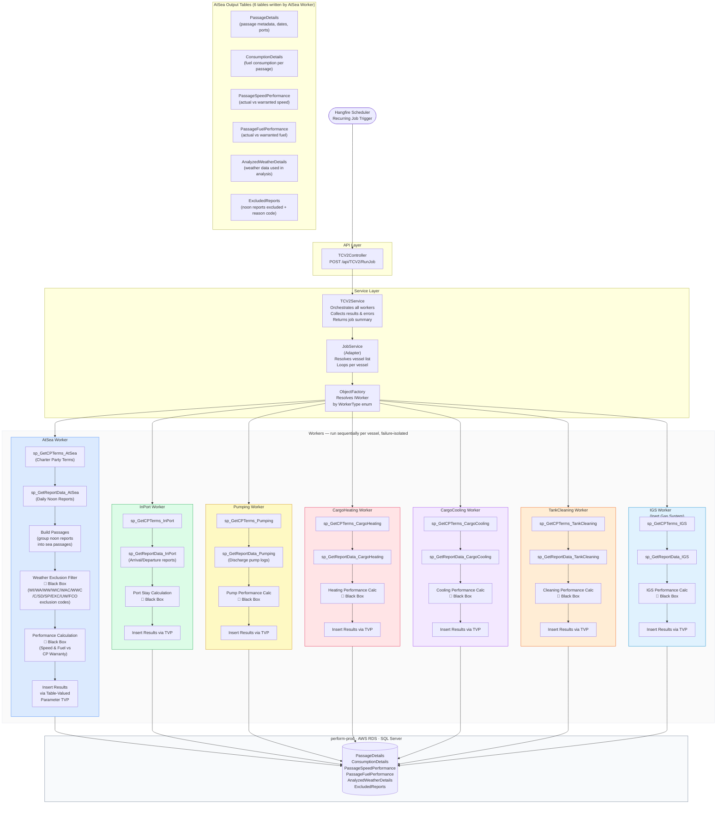

# TCV2 Job Architecture
## Charter Party Performance — Oil Tankers
### `gp-charterparty-jobs`

---



---

## AtSea Worker — Detailed Data Flow

```mermaid
flowchart TD
    START([Worker.Execute called\nper vessel per voyage]) --> TERMS

    subgraph FETCH["1 — Fetch Phase"]
        TERMS["Fetch CP Terms\nsp_GetCPTerms_AtSea\n→ Warranty speed/fuel,\nloaded/ballast, weather limits,\nallowances, vessel class"]
        TERMS --> REPORTS["Fetch Daily Reports\nsp_GetReportData_AtSea\n→ Noon reports:\nLat/Lon, Wind, Swell, Current,\nSpeed, FOC, Distance, Hours"]
    end

    REPORTS --> VALIDATE

    subgraph VALIDATE["2 — Validation Phase"]
        VALIDATE{"Reports found\n& CP Terms valid?"}
        VALIDATE -- No --> SKIP([Skip vessel — log reason])
        VALIDATE -- Yes --> PASSAGE
    end

    subgraph BUILD["3 — Passage Builder"]
        PASSAGE["Build Passages\n(group noon reports\nbetween departure & arrival\ninto sea passages)"]
        PASSAGE --> VOY["Aggregate into Voyages\n(Laden vs Ballast legs)"]
    end

    VOY --> WX

    subgraph WEATHER["4 — Weather Exclusion  🔲 Black Box"]
        WX["Evaluate each noon report\nagainst weather limits from CP Terms"]
        WX --> WX1{"Wind/Swell/Current\nexceeds threshold?"}
        WX1 -- Yes --> EXCL["Tag report with\nexclusion code:\nWI / WA / WW / C\n+ combined WIC/WAC/WWC"]
        WX1 -- No --> KEEP["Keep report\nin analysis"]
        EXCL --> EXCL2["Write to ExcludedReports table\nwith reason code + raw values"]
    end

    KEEP --> PERF
    EXCL --> PERF

    subgraph PERF["5 — Performance Calculation  🔲 Black Box"]
        PERF["Compute Speed Performance\n(actual vs CP warranted speed\nadjusted for current + allowances)"]
        PERF --> FUEL["Compute Fuel Performance\n(actual vs CP warranted FOC\nadjusted for sea conditions)"]
        FUEL --> WEATHER2["Compute Analyzed Weather\n(avg wind/swell used in calculation)"]
    end

    WEATHER2 --> INSERT

    subgraph INSERT["6 — Insert Phase"]
        INSERT["Serialize results to\nDataTable / TVP"]
        INSERT --> SP1["sp_InsertPassageDetails"]
        INSERT --> SP2["sp_InsertConsumptionDetails"]
        INSERT --> SP3["sp_InsertPassageSpeedPerformance"]
        INSERT --> SP4["sp_InsertPassageFuelPerformance"]
        INSERT --> SP5["sp_InsertAnalyzedWeatherDetails"]
        INSERT --> SP6["sp_InsertExcludedReports"]
    end

    subgraph EXCLUSION_CODES["Exclusion Code Reference"]
        EC["WI = Wind\nWA = Wave/Swell\nWW = Weather Waiting\nC = Current\nWIC = Wind+Current\nWAC = Wave+Current\nWWC = WW+Current\nSD = Speed Deviation\nSP = Stoppage\nEXC = Exceptional\nUW = Under Warranty\nFCO = FCO Clause"]
    end

    style FETCH fill:#dbeafe,stroke:#3b82f6
    style VALIDATE fill:#f0fdf4,stroke:#16a34a
    style BUILD fill:#fef9c3,stroke:#ca8a04
    style WEATHER fill:#ffe4e6,stroke:#e11d48
    style PERF fill:#f3e8ff,stroke:#9333ea
    style INSERT fill:#dcfce7,stroke:#16a34a
    style EXCLUSION_CODES fill:#f8fafc,stroke:#94a3b8
```
