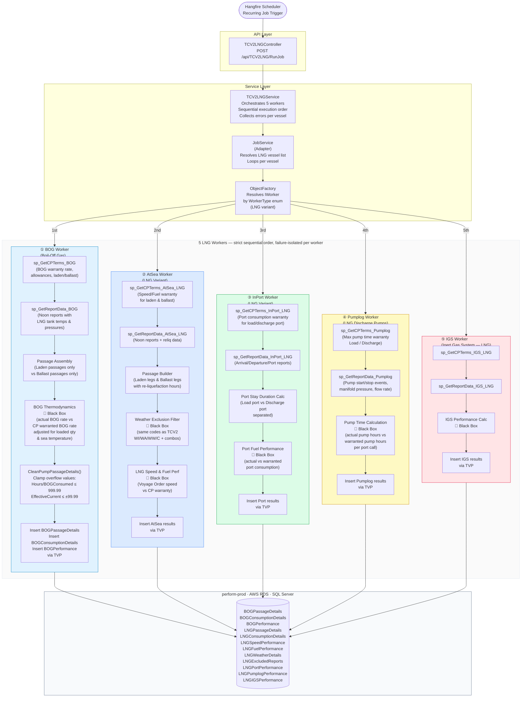
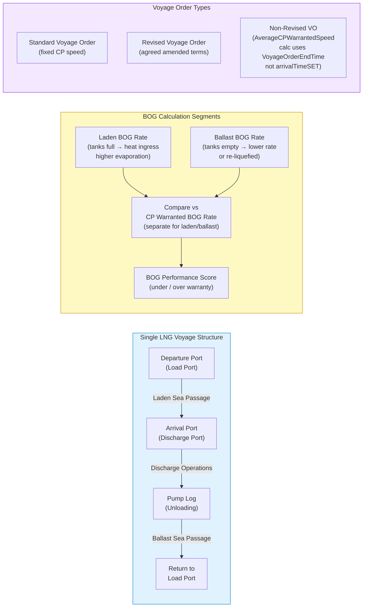
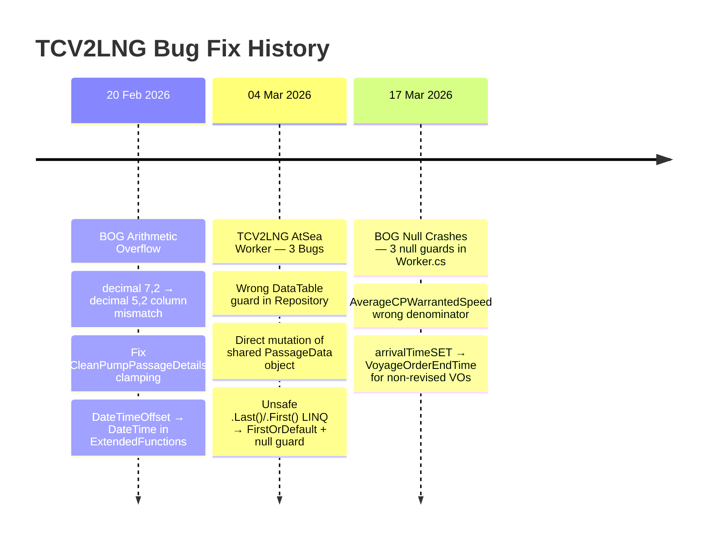

# TCV2LNG Job Architecture
## Charter Party Performance — LNG Carriers
### `gp-charterparty-jobs`

---

---

## BOG Worker — Passage & Voyage Lifecycle

---

## Known Bug Fixes Applied (all 3 fix batches)

