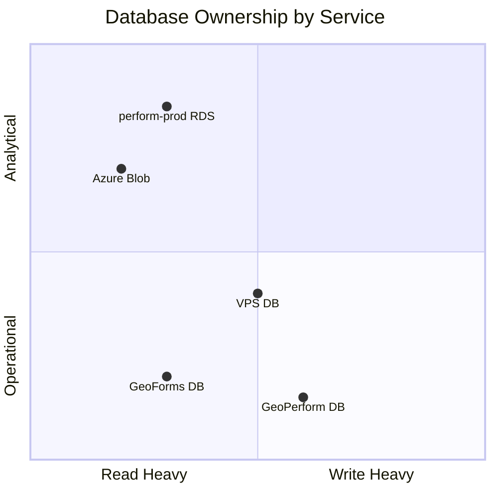
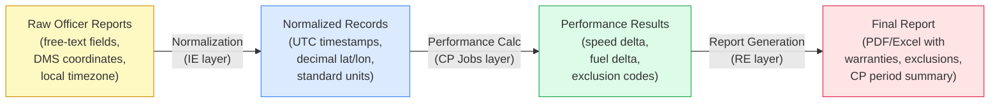

# End-to-End Data Architecture
## GeoForms → Ingestion Engine → Peform → Final Reports

---

```mermaid
flowchart TD
    %% ─────────────────────────────────────────
    %% LAYER 0 — Vessel Officers
    %% ─────────────────────────────────────────
    CREW(["👤 Vessel Officers\n(onboard ship)"])

    %% ─────────────────────────────────────────
    %% LAYER 1 — GeoForms
    %% ─────────────────────────────────────────
    subgraph GF["geo-forms · ABP Framework · .NET 8"]
        GF_SUBMIT["GeoFormsController\nPOST /submitted-forms\n(Departure / Noon / Arrival\nAtSea / InPort / Pumping)"]
        GF_APPROVE["AutoApprovalService\n30-min Hangfire Job\nAuto-approves submitted forms\nbased on configurable rules"]
        GF_INTEGRITY["DataIntegrityService\nDaily validation run\nFlags missing / malformed\nreport fields"]
        GF_ABB["AbbEtlService\n+ AbbPushQueueWorker\nPushes approved forms\nto ABB external platform\n(parallel pipeline)"]
        GF_SUBMIT --> GF_APPROVE
        GF_APPROVE --> GF_INTEGRITY
        GF_APPROVE --> GF_ABB
    end

    CREW -->|"Submit daily\nvessel reports\n(Noon / Port / Pump)"| GF_SUBMIT

    subgraph GFDB["GeoForms DB · SQL Server"]
        GF_DB[("SubmittedForms\nFormFields\nVesselFormStatus\nDynamicFilters\nAppDynamicFilters")]
    end

    GF_SUBMIT <-->|"Read/Write\nform data"| GF_DB
    GF_APPROVE <-->|"Update\napproval status"| GF_DB

    %% ─────────────────────────────────────────
    %% LAYER 2 — Ingestion Engine
    %% ─────────────────────────────────────────
    subgraph IE["gp-ingestionengine · ABP Framework · .NET 8"]
        direction TB
        IE_WORKER["GeoFormsInboundWorker\nRuns every 5 minutes\nvia ABP Background Job"]
        IE_WORKER --> IE_GUARD["① Duplicate Job Guard\n(AppGeoFormsInboundLogs\nprevents concurrent runs)"]
        IE_GUARD --> IE_DATE["② Incremental Date Ingestion\n(resume from last run date\nor fall back to 30 days)"]
        IE_DATE --> IE_CHUNK["③ Chunked Form Retrieval\n1000-row chunks (primary)\n100-row chunks (timeout fallback)\n200ms / 500ms inter-chunk pause"]
        IE_CHUNK --> IE_VALID["④ Deserialization & Validation\n6 gates:\nPrincipal → IMO → ReportType\n→ DynamicFilters → IMOmatch\n→ VesselFormStatus"]
        IE_VALID --> IE_DYN["⑤ Dynamic Filter Chain\nJSON expression rules\nfrom AppDynamicFilters\napplied as in-memory LINQ"]
        IE_DYN --> IE_DUP["⑥ Duplicate Detection\nmatch: FormId + IMO\n+ ReportDate + Location\nsoft-delete 10 related tables"]
        IE_DUP --> IE_NORM["⑦ Field Normalization\nDMS lat/lon parsing\nCompass direction standardization\nUTC decomposition\nBunker ROB routing\n(10-field priority chain)"]
        IE_NORM --> IE_VOY["⑧ Voyage Lifecycle\nDeparture → INSERT Voyages\nNoon → UPDATE VoyageNumber\nArrival → UPDATE ArrivalPort\n+ ActualEndOfSeaPassage"]
        IE_VOY --> IE_DEADLOCK["⑨ Deadlock Retry\n5 attempts, exponential backoff\n2s/4s/8s/16s + 0-999ms jitter"]
        IE_DEADLOCK --> IE_CHECK["⑩ Checkpoint Save\nevery 5 forms → save\nLatestResubmissionDate to DB"]
        IE_CHECK --> IE_EMAIL["⑪ Error Notification\nMicrosoft Graph API\nHTML email on failure"]
    end

    GF_DB -->|"Approved forms\n(OnSubmitted or\nOnApproved status)"| IE_WORKER

    subgraph VPSDB["VPS DB · SQL Server\n(Vessel Performance System)"]
        VPS[("Voyages\nVoyageReports\nNoonReports\nPortReports\nPumpReports\nVesselPositions\nBunkerROB\nWeatherData")]
    end

    IE_DEADLOCK -->|"INSERT / UPDATE\nnormalized records"| VPS

    subgraph GEOPERFDB["GeoPerform DB · SQL Server"]
        GP[("AppGeoFormsInboundLogs\nCheckpoints\nDynamicFilters")]
    end
    IE_GUARD <--> GP
    IE_CHECK <--> GP

    %% ─────────────────────────────────────────
    %% LAYER 3 — Charter Party Jobs
    %% ─────────────────────────────────────────
    subgraph CPJ["gp-charterparty-jobs · .NET 8 · Hangfire"]
        direction LR
        CPJ_TCV2["TCV2 Job\n(Oil Tankers)\n7 workers:\nAtSea, InPort, Pumping\nCargoHeating, CargoCooling\nTankCleaning, IGS"]
        CPJ_LNG["TCV2LNG Job\n(LNG Carriers)\n5 workers:\nBOG, AtSea, InPort\nPumplog, IGS"]
    end

    VPS -->|"Raw voyage &\ndaily report data\nvia Stored Procedures"| CPJ_TCV2
    VPS -->|"LNG report data\nvia Stored Procedures"| CPJ_LNG

    subgraph PERFDB["perform-prod · AWS RDS · SQL Server"]
        PERF[("PassageDetails\nConsumptionDetails\nPassageSpeedPerformance\nPassageFuelPerformance\nAnalyzedWeatherDetails\nExcludedReports\n────────────────\nBOGPassageDetails\nBOGPerformance\nLNGPassageDetails\nLNGSpeedPerformance\nLNGExcludedReports\nLNGPortPerformance\nLNGPumplogPerformance")]
    end

    CPJ_TCV2 -->|"Computed perf results\nvia TVP INSERT"| PERF
    CPJ_LNG -->|"Computed perf results\nvia TVP INSERT"| PERF

    %% ─────────────────────────────────────────
    %% LAYER 3b — Digital Twin (parallel)
    %% ─────────────────────────────────────────
    subgraph DT["gp-digital-twin · DTAPI + DTScheduler · .NET 8"]
        DT_SCHED["DTScheduler\nPython ML models:\nHANDYMAX.joblib\nLR2.joblib\nMR.joblib\nMR_weather_model1.joblib"]
        DT_UW["UwServices Module\n(Under Water Services)\nHull cleaning records\nDocking history\nEF Core · no SPs"]
    end

    VPS -->|"Vessel sensor &\nvoyage data"| DT_SCHED
    DT_SCHED -->|"Predicted performance\nbaselines"| PERF

    %% ─────────────────────────────────────────
    %% LAYER 4 — Report Engine
    %% ─────────────────────────────────────────
    subgraph RE["gp-reportengine-api · .NET 8"]
        RE_C["ReportController\nPOST /Report/NewReportRequest\nGET /Report/FetchStatusOfReport\nGET /Report/DownloadReport"]
        RE_W["ReportWorker\n(background polling)\nParallel.ForEach\nacross report sections"]
        RE_S["ReportService\nOrchestrates full pipeline\nvia IReport + ISection\nabstraction"]
        RE_QP["QuestPDF Renderer\nPDF generation\nFront Page, TotalPerformance\nWarranties, Summary\nSection, Methodology\nExcludedReports"]
        RE_C --> RE_W
        RE_W --> RE_S
        RE_S --> RE_QP
    end

    PERF -->|"Performance data\nread by Section workers"| RE_S

    subgraph BLOB["Azure Blob Storage\n/ S3"]
        PDF[("Generated Reports\n.PDF / .XLSX\nReport templates\nLogo assets")]
    end

    RE_QP -->|"Upload rendered\nPDF / Excel"| BLOB

    subgraph CLIENT["Report Consumers"]
        direction LR
        OPS["Operations Teams\n(Charterers, Owners)"]
        PORTAL["Web Portal\ngp-website"]
    end

    BLOB -->|"Download URL\nreturned to caller"| RE_C
    RE_C -->|"Report download\nlink"| PORTAL
    PORTAL --> OPS

    %% ─────────────────────────────────────────
    %% Styling
    %% ─────────────────────────────────────────
    style GF fill:#dbeafe,stroke:#3b82f6
    style IE fill:#dcfce7,stroke:#16a34a
    style CPJ fill:#fef9c3,stroke:#ca8a04
    style DT fill:#f3e8ff,stroke:#9333ea
    style RE fill:#ffe4e6,stroke:#e11d48
    style GFDB fill:#f8fafc,stroke:#94a3b8
    style VPSDB fill:#f8fafc,stroke:#94a3b8
    style GEOPERFDB fill:#f8fafc,stroke:#94a3b8
    style PERFDB fill:#f8fafc,stroke:#94a3b8
    style BLOB fill:#f8fafc,stroke:#94a3b8
    style CLIENT fill:#fafafa,stroke:#e2e8f0
```

---

## Database Responsibility Matrix

```mermaid
quadrantChart
    title Database Ownership by Service
    x-axis Read Heavy --> Write Heavy
    y-axis Operational --> Analytical

    GeoForms DB: [0.3, 0.2]
    VPS DB: [0.5, 0.4]
    GeoPerform DB: [0.6, 0.15]
    perform-prod RDS: [0.3, 0.85]
    Azure Blob: [0.2, 0.7]
```

---

## Data Transformation Summary

```mermaid
flowchart LR
    RAW["Raw Officer Reports\n(free-text fields,\nDMS coordinates,\nlocal timezone)"]
    -->|"Normalization\n(IE layer)"| NORM["Normalized Records\n(UTC timestamps,\ndecimal lat/lon,\nstandard units)"]
    -->|"Performance Calc\n(CP Jobs layer)"| PERF2["Performance Results\n(speed delta,\nfuel delta,\nexclusion codes)"]
    -->|"Report Generation\n(RE layer)"| FINAL["Final Report\n(PDF/Excel with\nwarranties, exclusions,\nCP period summary)"]

    style RAW fill:#fef9c3,stroke:#ca8a04
    style NORM fill:#dbeafe,stroke:#3b82f6
    style PERF2 fill:#dcfce7,stroke:#16a34a
    style FINAL fill:#ffe4e6,stroke:#e11d48
```
