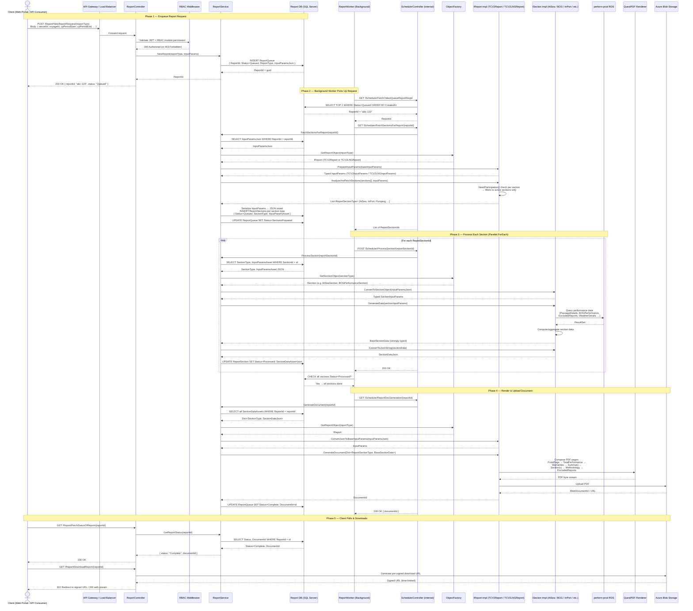
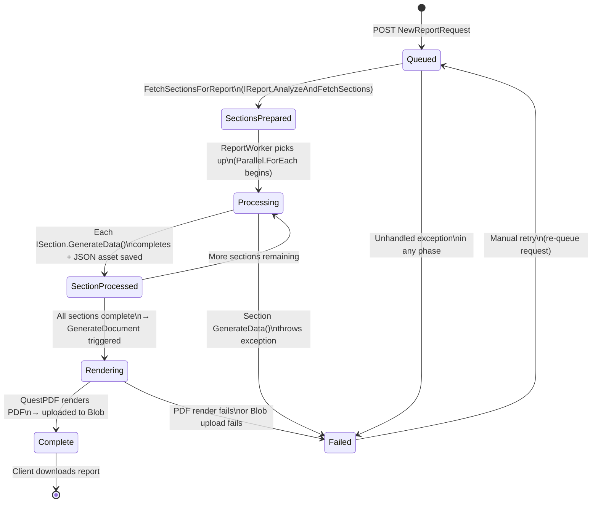
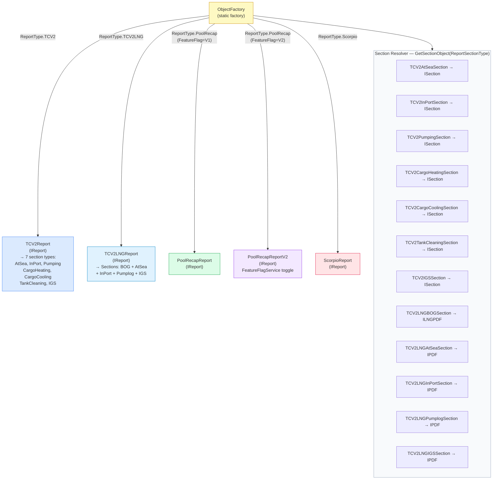
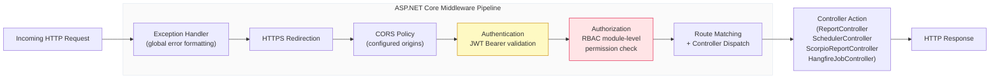

# Request Pipeline Flow Diagram
## gp-reportengine-api · Full HTTP Request Lifecycle

---

## Report Request → PDF Delivery Pipeline

---

## Report Status State Machine

---

## ObjectFactory — Report Type Routing

---

## Middleware & Cross-Cutting Concerns

