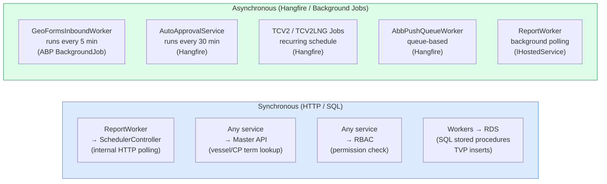
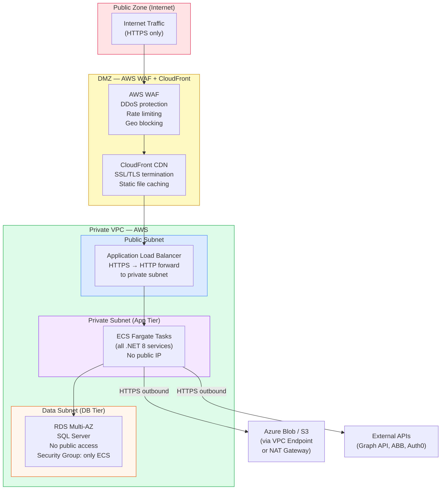
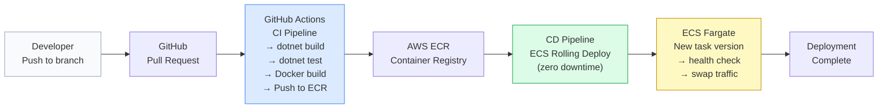

# Peform Platform — Infrastructure Diagram
## Full System Infrastructure (inferred from codebase)

---

## Infrastructure Overview

```mermaid
flowchart TD
    %% ─── External Users ───────────────────────────────────────
    subgraph USERS["External Actors"]
        VESSEL["👤 Vessel Officers\n(at sea, onboard)"]
        OPS["👤 Operations Teams\n(Charterers / Owners)"]
        ADMIN["👤 Administrators"]
    end

    %% ─── CDN / DNS ────────────────────────────────────────────
    subgraph DNS["DNS + CDN Layer"]
        CF["CloudFront / CDN\n(static asset delivery\ngp-website frontend)"]
    end

    VESSEL --> CF
    OPS --> CF
    ADMIN --> CF

    %% ─── API Gateway ──────────────────────────────────────────
    subgraph AGW["API Gateway / Load Balancer (AWS ALB)"]
        ALB["Application Load Balancer\nSSL Termination\nPath-based routing\n/api/* → backend services"]
    end

    CF --> ALB

    %% ─── Application Services (ECS / EC2) ─────────────────────
    subgraph COMPUTE["Application Services — AWS ECS (Fargate) / EC2"]

        subgraph GForms["geo-forms\n(ABP .NET 8)"]
            GF1["GeoFormsController\nSubmittedFormService"]
            GF2["AutoApprovalService\n(Hangfire — 30 min)"]
            GF3["AbbPushQueueWorker\n(Hangfire — ABB ETL)"]
            GF4["DataIntegrityService\n(Hangfire — daily)"]
        end

        subgraph IngEng["gp-ingestionengine\n(ABP .NET 8)"]
            IE1["GeoFormsInboundWorker\n(every 5 min)"]
            IE2["Deadlock Retry Logic\n5 attempts exp. backoff"]
            IE3["Microsoft Graph API\nError Email Notifier"]
        end

        subgraph CPJobs["gp-charterparty-jobs\n(.NET 8 + Hangfire)"]
            CP1["TCV2 Job\n(Oil Tankers)\n7 Workers"]
            CP2["TCV2LNG Job\n(LNG Carriers)\n5 Workers"]
            CP3["Hangfire Dashboard\n/hangfire"]
        end

        subgraph DTwin["gp-digital-twin\n(.NET 8 DTAPI + DTScheduler)"]
            DT1["DTAPI\nUwServices endpoints\nVessel analytics"]
            DT2["DTScheduler\nPython ML inference\n.joblib models"]
        end

        subgraph RepEng["gp-reportengine-api\n(.NET 8)"]
            RE1["ReportController\n(public API)"]
            RE2["SchedulerController\n(internal only)"]
            RE3["ReportWorker\n(background polling)"]
            RE4["QuestPDF Renderer"]
        end

        subgraph OtherAPIs["Supporting APIs"]
            MA["gp-master-api\nVessel master data\nCP terms"]
            UA["gp-user-api\nUser management\nJWT issuance"]
            RA["gp-rbac\nRole-based access\nmodule permissions"]
            VA["gp-voyage-api\nVoyage data"]
            SA["gp-sensorengine-api\nSensor data ingestion"]
            LIB["gp-library-api\nShared utilities"]
        end

    end

    ALB --> GForms
    ALB --> IngEng
    ALB --> CPJobs
    ALB --> DTwin
    ALB --> RepEng
    ALB --> OtherAPIs

    %% ─── Databases ────────────────────────────────────────────
    subgraph RDS["AWS RDS — SQL Server (Multi-AZ)"]
        GF_DB[("GeoForms DB\nSubmittedForms\nFormFields\nDynamicFilters")]
        VPS_DB[("VPS DB\nVoyages, NoonReports\nPortReports\nBunkerROB")]
        GP_DB[("GeoPerform DB\nIngestion logs\nCheckpoints\nFilters")]
        PERF_DB[("perform-prod\nPassage performance\nBOG performance\nWeather/Exclusion data")]
        REPORT_DB[("Report Engine DB\nReportQueue\nReportSections\nSection assets JSON")]
        MASTER_DB[("Master DB\nVessel registry\nCP terms\nPrincipals")]
    end

    GForms <-->|"Read/Write"| GF_DB
    IngEng <-->|"Read GeoForms\nWrite VPS + GP"| GF_DB
    IngEng <-->|"Write voyages\n& reports"| VPS_DB
    IngEng <-->|"Checkpoint\n& job logs"| GP_DB
    CPJobs <-->|"Read VPS (SP)\nWrite performance"| VPS_DB
    CPJobs <-->|"Write perf results\nvia TVP"| PERF_DB
    DTwin <-->|"Read sensor &\nvoyage data"| VPS_DB
    DTwin <-->|"Write ML predictions"| PERF_DB
    RepEng <-->|"Queue management\n& section assets"| REPORT_DB
    RepEng <-->|"Read perf data"| PERF_DB
    OtherAPIs <-->|"Vessel master\n& user data"| MASTER_DB

    %% ─── Storage ──────────────────────────────────────────────
    subgraph STORAGE["Cloud Storage"]
        BLOB[("Azure Blob Storage\n(or AWS S3)\nGenerated PDF/Excel reports\nReport templates\nLogo assets\nML model .joblib files")]
    end

    RepEng -->|"Upload PDFs"| BLOB
    DTwin -->|"Load .joblib models"| BLOB
    CF -->|"Static site\nassets"| BLOB

    %% ─── External Services ────────────────────────────────────
    subgraph EXT["External Services"]
        GRAPH["Microsoft Graph API\n(email notifications\non ingestion failures)"]
        ABB["ABB Platform\n(external ETL push\nfor vessel data)"]
        WX["Weather Data Provider\n(wind/swell/current\ndata for exclusion analysis)"]
        AUTH["Auth0 / Identity Provider\n(JWT token issuance\nfor user authentication)"]
    end

    IngEng -->|"Error alerts"| GRAPH
    GForms -->|"Push approved forms"| ABB
    CPJobs -->|"Fetch weather data\nfor exclusion calc"| WX
    OtherAPIs -->|"Token validation"| AUTH

    %% ─── Monitoring ───────────────────────────────────────────
    subgraph MON["Observability"]
        CW["AWS CloudWatch\nLogs + Metrics\nAlarms"]
        HF_DASH["Hangfire Dashboard\n(job monitoring\nretry management)"]
        DBOBS["gp-db-observability\n(DB health monitoring)"]
    end

    COMPUTE -->|"Logs + metrics"| CW
    CPJobs --> HF_DASH
    RDS -->|"Query metrics"| DBOBS

    %% ─── Styling ──────────────────────────────────────────────
    style USERS fill:#f8fafc,stroke:#94a3b8
    style DNS fill:#e0f2fe,stroke:#0284c7
    style AGW fill:#fef9c3,stroke:#ca8a04
    style GForms fill:#dbeafe,stroke:#3b82f6
    style IngEng fill:#dcfce7,stroke:#16a34a
    style CPJobs fill:#fef9c3,stroke:#ca8a04
    style DTwin fill:#f3e8ff,stroke:#9333ea
    style RepEng fill:#ffe4e6,stroke:#e11d48
    style OtherAPIs fill:#f1f5f9,stroke:#94a3b8
    style RDS fill:#fff7ed,stroke:#ea580c
    style STORAGE fill:#f0fdf4,stroke:#16a34a
    style EXT fill:#fafafa,stroke:#e2e8f0
    style MON fill:#fafafa,stroke:#e2e8f0
```

---

## Service-to-Service Communication Matrix

---

## Network & Security Zones

---

## Deployment Pipeline (CI/CD)

